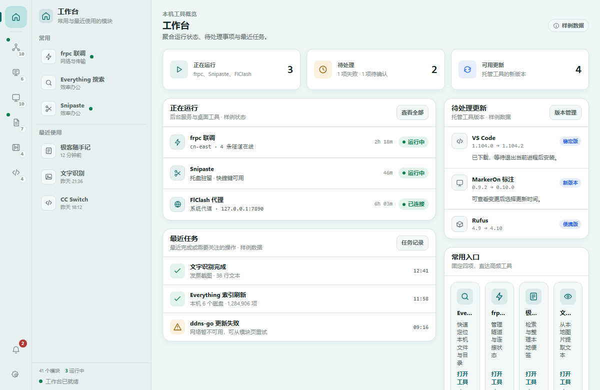
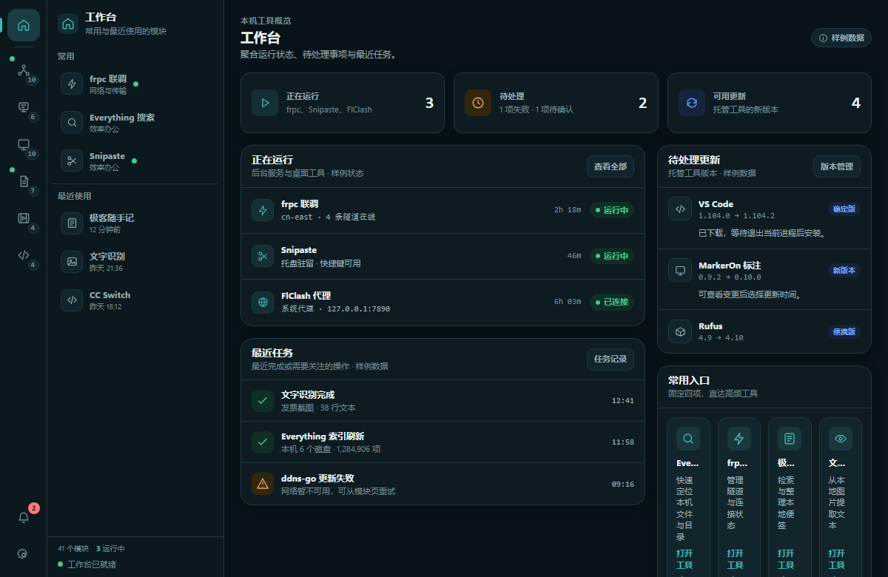
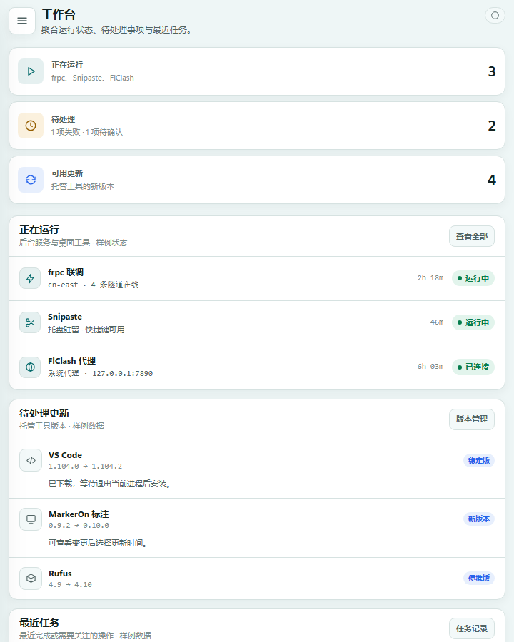

# 工作台首页演进设计资产

本目录记录 Hanxi 未来首页的静态设计稿。它用于评审信息架构、响应式行为与主题适配，不是可直接接入业务的实现。

## 文件

- `workbench-home.html`：单源响应式 HTML。引用生产设计 token `../../../frontend/src/styles/tokens.css`，不调用 Wails API。
- 页面中的模块名称来自当前 Hanxi 模块注册表；所有数量、状态、版本、时间与任务进度均明确标注为样例数据。

## 预览参数

页面读取以下 query 参数，仅影响当前预览，不写入存储：

- `theme=light|dark`
- `accent=teal|sky|iris|jade|onyx`

默认组合为 Jade 浅色：

```text
workbench-home.html?theme=light&accent=jade
```

Teal 深色验收组合：

```text
workbench-home.html?theme=dark&accent=teal
```

无效参数会回退到 `theme=light&accent=jade`。

## 预览图

三张 PNG 均由同一份 `workbench-home.html` 渲染，不做后期修图：

| 文件名 | 目标尺寸 | 主题与验收重点 |
|---|---:|---|
| `workbench-home-jade-light.png` | 1200 × 780 px | Jade 浅色桌面；保留双栏 Shell 与双列主内容 |
| `workbench-home-teal-dark.png` | 1200 × 780 px | Teal 深色桌面；验证独立深色层次和状态对比 |
| `workbench-home-jade-narrow.png` | 720 × 900 px | Jade 浅色窄窗口；导航转抽屉入口、内容单列重排 |

另在 390px 宽度和 200% 浏览器缩放下进行响应式检查，但不额外生成图片。

### Jade 浅色桌面



### Teal 深色桌面



### Jade 窄窗口



## 设计边界

- 保留当前双栏 Shell 语义：一级分类轨道、二级工作台面板、内容主视口；在窄屏做结构性降级。
- 首页包含紧凑页头、正在运行／待处理／可用更新三项摘要、运行列表、待处理更新、最近任务和四个常用入口。
- 不使用大面积渐变、玻璃拟态、营销 Hero 或装饰性持续动画。
- 图标均为线性内联 SVG；状态同时通过文字、图标或结构表达，不仅依赖颜色。
- 支持键盘焦点、语义化区域、浏览器缩放、粗指针触控尺寸、安全区和 `prefers-reduced-motion`。
